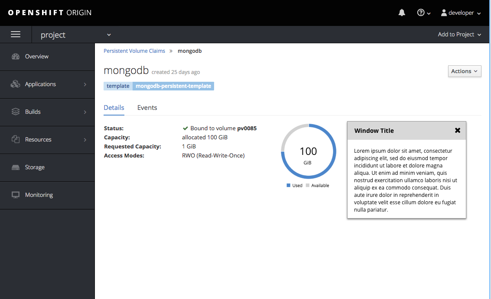

# Modeless Overlay

A modeless overlay panel displays more detailed information about an object or page while still allowing the user to interact with the UI that is behind the panel.

Some of the general use cases for the modeless overlay include:
- If the user needs to access more detailed information from a list or dashboard.
- If the user needs more detailed information while still needing access to the underlying UI.
- Quick access to details without leaving a main page.
- A substitute for a modal overlay when the underlying UI directly affects the surfaced details.
- The user needs access to Page- or section-level help, or other contextual documentation.

Examples of more detailed use cases for the modeless overlay include:
- This pattern should be used only for detailed or secondary information, primary information should not live on this panel.
- The underlying information should be directly related to the detailed information that is surfaced on the panel.  
- This pattern could be used to add, view, edit, and remove detailed information of an individual item.
- This pattern may be used for contextual help when more information is needed than can be provided in a popover.

Notes about the behavior of the modeless overlay panel:
- The height of the modeless overlay is determined by its contents.
- The modeless overlay has two variants: anchored and free-floating.
- The anchored variant is attached to the side of the viewport.
- The free-floating variant is not attached to the edge of the viewport and may be dragged to a desired location on the screen.
- An anchored overlay may be dragged off of its anchor to become free-floating.
- The text boxes and fields featured on the overlay panel allow the user to edit them inline.  
- The overlay panel never bleeds onto the main navigation, it rests in the main content area of the page.
- There is a slight shadow that appears around the edge of the overlay panel to reinforce that it is on another layer.
- The user can still access the UI layer underneath the overlay panel.

## Anchored Modeless Overlay

## Free-floating Modeless Overlay

## Open Questions
- Should a free-floating overlay scroll with the underlying page, or maintain the same position with respect to the viewport (does the page scroll behind the overlay)? I.e. does it attach to/rest on the page below, or float above?
- Could a user have multiple free-floating overlays at the same time? Or a combination of anchored and free-floating? If so, each would need its own z-index: Newer overlays should sit atop older overlays.
- Would we want to prescribe some set widths? E.g. S, M and L.
